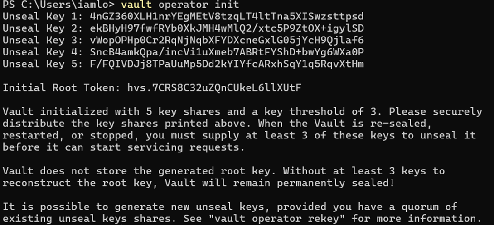

## Key Sharing

5 unseal keys generated to decrypt the root key, minimum 3 keys are required to construct the root key.

## Auto-Unseal

Problem with manual unseal vault restarts becomes sealed, then humans must find unseal keys enter 3 out of 5 to unseal.

Now auto-unseal removes the human step.

Auto-unseal means vault automatically gets its master/root key using trusted external key service, without human typing the unseal keys.

### steps involved

1. Vault starts, vault is sealed, reads encrypted root key from storage.

2. Vault says to cloud KMS service “Hey KMS, I have this encrypted blob. I’m authorized. Please decrypt it”.
   Vault sends encrypted root key, authentication (IAM role / Credentials).

3. Inside KMS, KEK decrypts the encrypted root key.

4. KMS returns the plain text root key. (only in memory)

5. vault unseals, root key decrypts the internal encryption keys, root key stays only in RAM.

## Transit Auto Unseal:

Used when we don’t want to use cloud KMS and don’t want vault to have the internet access
**_One vault act like a KMS to unseal other vaults_**

### overview

    Vault A (Transit Vault) contains Transit Key (acts like KEK) \
    Vault B (Prob Vault) \
    Vault C (Non-Prod Vault)

### steps involved:

Vault A does not store secrets, Vault B and Vault C stores real secrets, Vault A only helps unlock B & C.\
Vault B send encrypted root key to vault A \
Vault A decrypts it using Transit key \
Vault A return plain-text root key (memory only) \
Vault B decrypts internal encryption key \
Vault B is unsealed
